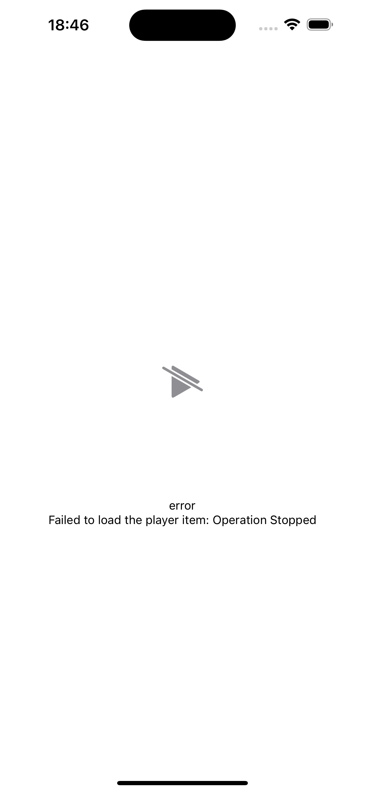

# expo video bug reproduction

## Repro Steps

1. Create new app:
```zsh
npx create-expo-app@latest --template blank
```

2. Add `expo-video`
```zsh
npx expo install expo-video
```

3. Add a basic `<VideoView` (see [example](https://docs.expo.dev/versions/latest/sdk/video/#usage)) and add `https://nerdy.dev/media/switch-homescreen-demo.mp4` as video source

4. Run `npm run ios`

## Error

The error output is:

> Failed to load the player item: Operation Stopped

This does not happen with the [video from the expo-video example](https://docs.expo.dev/versions/latest/sdk/video/)

